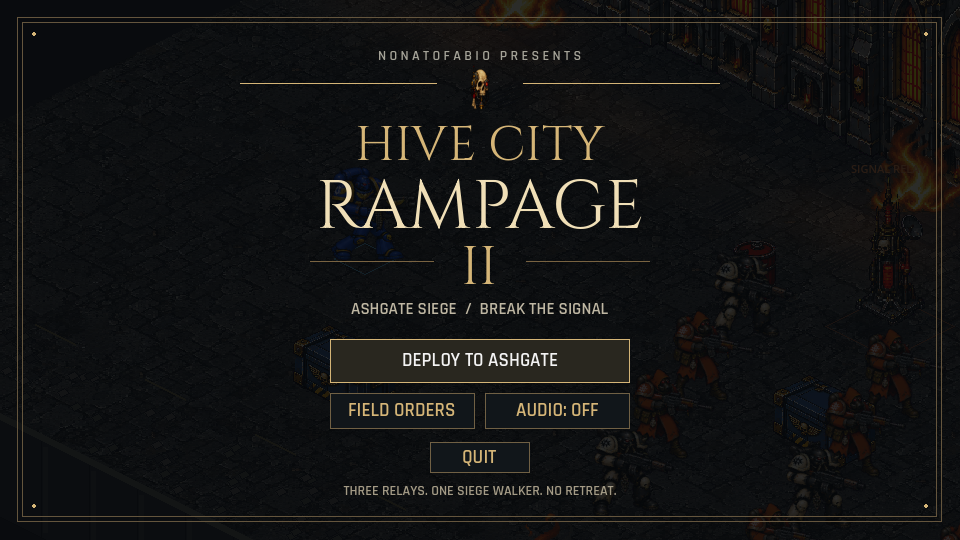

# Hive City Rampage II

A gothic isometric shooter by **nonatofabio**, built in **Godot 4**.
Deploy into Ashgate, destroy three signal relays, bring down the siege walker,
and fight your way to extraction.



## Play and develop

Download macOS and Android previews from [Releases](https://github.com/nonatofabio/hive-city-rampage-ii/releases).
The previews use local test signing: macOS is not notarized; Android uses a debug key.

From source, install Godot 4.3, Make, and Python 3 (standard library only):

```sh
make run       # Launch the title screen
make editor    # Open the Godot editor
make test      # Menu, touch, combat, and silhouette checks
make build     # macOS + Android packages; requires the export toolchain
make capture   # Title, mission, and animation review images
make clean     # Delete generated builds and Godot caches
```

Use `make run GAME_ARGS="--mute --touch"` to preview the touch interface on desktop.
Set tool paths in ignored `Makefile.local` or on the command line, for example
`make run GODOT_BIN=/path/to/Godot`. See [BUILDING.md](BUILDING.md) for export setup.
You can also open `godot/project.godot` directly in Godot; Python is not a game runtime dependency.

| Action | Desktop | Android |
| --- | --- | --- |
| Move | WASD | Left stick |
| Aim / fire | Mouse / left click | Right stick |
| Grenade | Space / right click | FRAG |
| Dash | Shift | DASH |
| Pause | Escape | PAUSE |

## Project layout

- `godot/`: game scenes, scripts, runtime assets, and native tests.
- `art/`: editable Blender sources and original audio clips.
- `tools/`: standard-library helpers used by Make for validation and packaging.
- `static/`: current title-screen preview.

## Origins and credits

Sequel to [Hive City Rampage](https://github.com/nonatofabio/hive-city-rampage).
The original top-down Pygame game credits Claude; its README/screenshots commit
`3f5f993` names Claude Opus 4.5, while the gameplay commits do not specify a model.
The native Godot implementation and sequel menu were developed with Codex (GPT-6),
under Fabio Nonato’s direction.

The final art handoff is `b9828a6` in the original repository. The sequel contains
its own runtime assets and frozen reference fixtures; legacy engines and their
asset-generation programs remain in the original project.

Typography: Cinzel by Natanael Gama and Rajdhani by Indian Type Foundry.
Font licenses ship in `godot/assets/fonts/`. See [audio credits](godot/assets/audio/CREDITS.md)
and [historical art provenance](godot/assets/ART_PROVENANCE.md).
