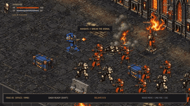
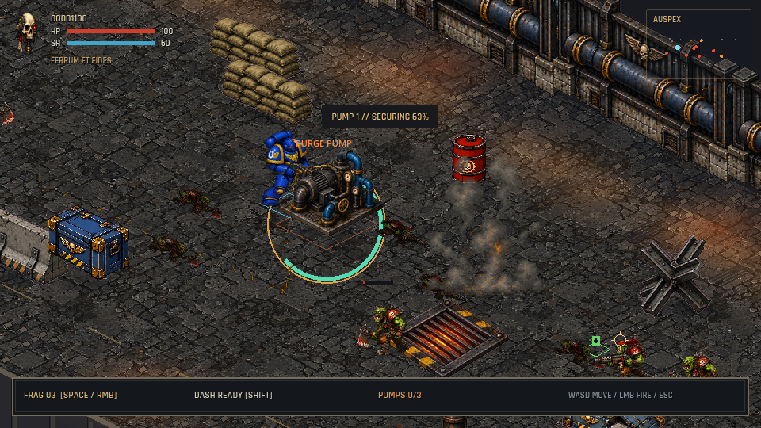

# Hive City Rampage II

A gothic isometric shooter by **nonatofabio**, built in **Godot 4**.
Deploy into Ashgate, destroy three signal relays, bring down the siege walker,
and fight your way to extraction. Then deploy into **Iron Belly**, secure three
coolant pumps, and defeat an Ork Warboss. Select either mission on the title screen.


## Gameplay



[Watch the 14-second gameplay movie with audio](static/gameplay.mp4).
Crates, barrels, and relays leave persistent wreckage. Sandbags, concrete barriers,
and steel tank traps provide indestructible cover.

## Iron Belly — level two



[Watch level two gameplay](static/iron-belly.mp4). Hold each pump area for eight
seconds while keeping nearby Orks away. Avoid cycling hot vents, defeat the
Warboss, and reach extraction. Press N after winning Ashgate (or tap on Android)
to advance. New art and prompts: [Orks](art/orks/README.md),
[industrial machinery](art/industry/README.md).

## Play and develop

Download macOS and Android previews from [Releases](https://github.com/nonatofabio/hive-city-rampage-ii/releases).
The previews use local test signing: macOS is not notarized; Android uses a debug key.

From source, install Godot 4.3, Make, and Python 3 (standard library only):

```sh
make run       # Launch the title screen
make editor    # Open the Godot editor
make test      # Menu, touch, combat, and silhouette checks
make build     # macOS + Android + Linux/Steam Deck packages; requires the export toolchain
make capture   # Title, mission, and animation review images
make record    # Gameplay MP4 and small GIF; requires ffmpeg
make clean     # Delete generated builds and Godot caches
```

Use `make run GAME_ARGS="--mute --touch"` to preview the touch interface on desktop.
Set tool paths in ignored `Makefile.local` or on the command line, for example
`make run GODOT_BIN=/path/to/Godot`. See [BUILDING.md](BUILDING.md) for export setup.
You can also open `godot/project.godot` directly in Godot; Python is not a game runtime dependency.

| Action | Desktop | Android touchscreen | Controller |
| --- | --- | --- | --- |
| Move | WASD | Left virtual stick | Left stick / D-pad |
| Aim / fire | Mouse / left click | Right virtual stick | Right stick (move cursor), R2 (fire) |
| Grenade | Space / right click | FRAG | L2 |
| Dash | Shift | DASH | Left stick click (L3) |
| Pause | Escape | PAUSE | Start |

Physical gamepads work on Android and desktop alongside touchscreen controls.
Use the D-pad and A to navigate menus, or Start to deploy. On the pause/result
screen, A resumes, retries, or advances to Iron Belly; B returns to the menu.
Button names follow the standard Xbox layout (Retroid labels may vary with its
controller mode). Sticks use a 20% dead zone. The right stick moves a free screen cursor, which
stays in place when released. Triggers activate above 55% to support Android
mappings that idle at 50%; disconnecting a controller pauses play and clears firing.
The title menu includes Quit on Android. Field Orders opens a separate view;
use Back to Menu, B, Start, or Android Back to close it.

## Combat and options

Hold fire near an enemy to swing the chainsword; outside melee reach, the bolter
fires normally. L2/Space still throws a grenade and L3/Shift still dashes.

Options offers cursor speeds from 0.5× to 3× (default 1.5×), Wide/Normal/Close
views, and sound level. Settings persist between launches. Open Options from
the title menu, or with Y/O while paused. The HUD stays the same size at every view.

Weapon audio is original procedural synthesis: four bolter reports, three grenade
blasts, two relay collapses, and three chainsword attacks. Separate voice pools
preserve explosion tails during gunfire. [Audio sources and regeneration](art/audio/README.md).

[Steam Deck installation and Linux export](STEAM-DECK.md). The native Linux x86-64
release runs without Proton and supports Steam Input's standard Gamepad layout.

The player uses measured pelvis sockets per leg frame and pixel-aligned body
placement. [Full pose rendering and alignment audit](tools/README-seam-audit.md).

## Project layout

- `godot/`: game scenes, scripts, runtime assets, and native tests.
- `art/`: editable Blender sources and original audio clips.
- `tools/`: standard-library helpers used by Make for validation and packaging.
- `static/`: current title-screen preview.

## Origins and credits

Read the development write-up: [AI-generated pixel art needs a build system, not better prompts](https://dev.to/nonatofabio_28/ai-generated-pixel-art-needs-a-build-system-not-better-prompts-280c).

Sequel to [Hive City Rampage](https://github.com/nonatofabio/hive-city-rampage).
The original top-down Pygame game credits Claude; its README/screenshots commit
`3f5f993` names Claude Opus 4.5, while the gameplay commits do not specify a model.
The native Godot implementation and sequel menu were developed with Codex (GPT-6),
under Fabio Nonato’s direction.

The final art handoff is `b9828a6` in the original repository. The sequel contains
its own runtime assets and frozen reference fixtures; legacy engines and their
asset-generation programs remain in the original project.

Typography: Cinzel by Natanael Gama and Rajdhani by Indian Type Foundry.
Font licenses ship in `godot/assets/fonts/`. See [audio credits](godot/assets/audio/CREDITS.md)
and [historical art provenance](godot/assets/ART_PROVENANCE.md).
