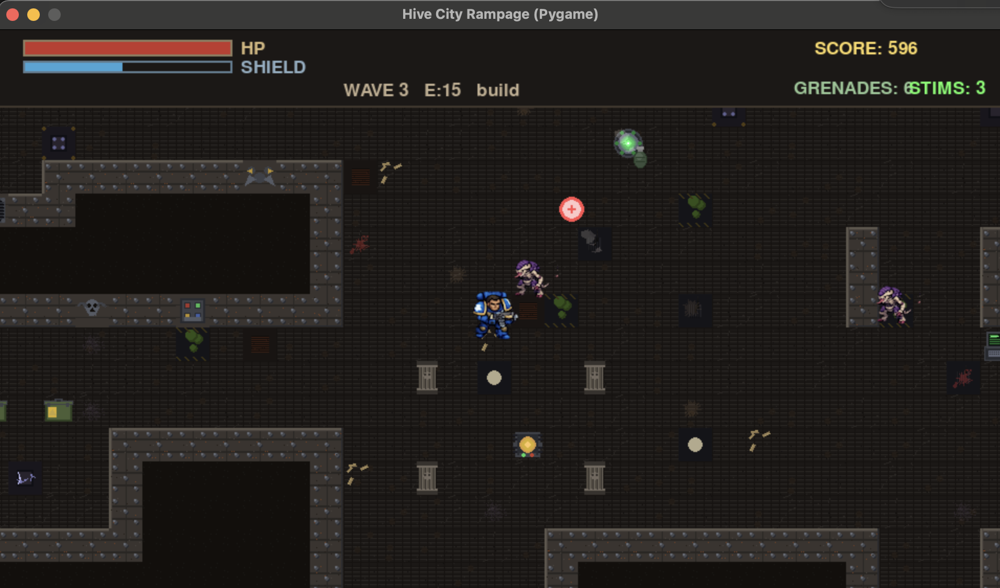
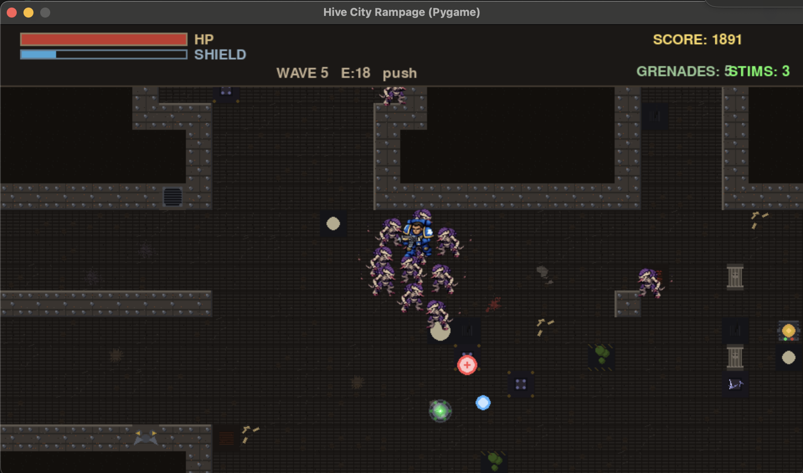

# 🔥 HIVE CITY RAMPAGE

**Godot test worktree:** double-click [Play Godot.command](Play%20Godot.command)
to run the native Godot port of Ashgate Siege, or open `godot/project.godot` in
Godot. See [Godot setup, validation, and migration notes](godot/README.md).
The Pygame version below remains available as the comparison reference.

**New default mode: Ashgate Siege.** Fight through a burning isometric gothic street, destroy three signal relays, defeat a giant siege walker, and reach extraction. Includes destructible cover, explosive barrels, grenades, a dodge dash, a tactical minimap, bolter gunfire, and Blender-rendered sprite walking and weapon recoil.

```sh
.venv/bin/python src/pyg/hive_city_rampage.py
```

WASD moves, mouse aims, left-click fires, Space/right-click throws grenades, Shift dashes, and Escape pauses. Use `--classic` for the original top-down survival game described below. See [Ashgate controls and implementation](docs/ASHGATE.md).

Alpha 1 is preserved at `v0.2.0-alpha.1`. The sound and motion polish is developed separately on `feat/ashgate-audio-motion`. Only bolter gunfire is enabled; music and the other effects have been removed. [Servo HUD and casing preview](static/ashgate-servo-hud.mp4) · [Weapons, stride, and fades](static/ashgate-weapons.mp4) · [Effects and death preview](static/ashgate-effects.mp4) · [Directional aiming preview](static/ashgate-directions.mp4) · [Motion preview](static/ashgate-motion.mp4) · [Audio credits](src/pyg/assets/audio/CREDITS.md).


---

**A grim dark top-down shooter where you're humanity's last line of defense against endless xeno horrors**

[](https://www.python.org/downloads/)
[](https://www.pygame.org/)
[](LICENSE)
[]()

<p align="center">
  
  
</p>

---

## 🎮 SURVIVE. ADAPT. RAMPAGE.

Deep in the bowels of a corrupted hive city, you stand alone against waves of ravenous alien swarms. Armed with only your wits, a rapid-fire weapon, and a handful of frag grenades, you must hold the line as long as humanly possible.

Every second counts. Every shot matters. Every wave gets deadlier.

**How long can you survive?**

---

## ✨ KEY FEATURES

### 🌊 **Dynamic Wave-Based Combat**
- Intelligent enemy spawning system that adapts to your performance
- Four enemy types with unique behaviors: agile Runners, relentless Grunts, dangerous Shooters, and hulking Brutes
- Escalating difficulty with strategic breathing room between waves

### 🎯 **Fluid Combat System**
- Precision mouse aiming with aim assist for satisfying gunplay
- WASD movement with momentum-based physics
- Devastating area-of-effect grenades (space bar)
- Shield regeneration mechanics reward tactical play
- Combo system for skilled players

### 🗺️ **Procedurally Generated Arenas**
- Every playthrough features unique layouts with autotiling wall systems
- Environmental hazards: toxic pools, electrical panels, heat zones
- Animated terrain elements: flickering lights, steam vents, sparking machinery
- Dynamic battlefield clutter: blood pools, debris, shell casings

### 💉 **Survival Mechanics**
- Shield system with regeneration delays (stop shooting to recover!)
- Stim Packs provide last-ditch revival (3 per run)
- Health and shield pickups from defeated enemies
- Grenade pickups to replenish your explosive arsenal

### 🎨 **Grim Dark Aesthetic**
- Hand-crafted sprite animations with industrial sci-fi vibes
- Dynamic visual effects: explosions, smoke clouds, shockwaves
- Environmental storytelling through decals and destruction
- Screen shake and visual polish for impactful combat

---

## 🚀 QUICK START

### Prerequisites
- Python 3.13.1 or higher
- uv package manager (recommended) or pip

### Installation

1. **Clone the repository**
   ```bash
   git clone https://github.com/yourusername/hive-city-rampage.git
   cd hive-city-rampage
   ```

2. **Set up the virtual environment**
   ```bash
   uv venv
   source .venv/bin/activate  # On Windows: .venv\Scripts\activate
   uv pip install pygame
   ```

3. **Launch the game**
   ```bash
   cd src/pyg
   ../../.venv/bin/python hive_city_rampage.py
   ```

### Controls
- **WASD** - Move your marine
- **Mouse** - Aim your weapon
- **Left Click** - Fire primary weapon
- **Space** - Throw grenade (3 second cooldown)
- **ESC** - Pause / Menu

---

## 🎯 ALPHA STATUS

This is an **early alpha build** and we're actively looking for feedback! The core gameplay loop is solid, but there's still plenty of polish and features in the works.

### What's Working
- ✅ Core combat loop with 4 enemy types
- ✅ Wave-based progression system
- ✅ Procedural arena generation
- ✅ Shield/health mechanics
- ✅ Grenade system
- ✅ Scoring and combo system
- ✅ Stim pack revival system

### Known Issues / WIP
- ⚠️ Balance tuning needed for higher waves
- ⚠️ Sound effects and music not yet implemented
- ⚠️ Limited enemy variety (more types coming!)
- ⚠️ UI/HUD needs visual polish
- ⚠️ No progression system between runs (planned)

### Upcoming Features
- 🔜 Weapon upgrades and customization
- 🔜 More enemy types and behaviors
- 🔜 Boss waves
- 🔜 Persistent progression system
- 🔜 Audio/music integration
- 🔜 Multiple arena biomes

---

## 🤝 WE WANT YOUR FEEDBACK!

As an alpha tester, your feedback is invaluable! Please report:
- Bugs and crashes
- Balance issues (too easy/hard?)
- Control feel and responsiveness
- Performance problems
- Ideas for features or improvements

**Submit feedback via:**
- GitHub Issues: [Create an issue](https://github.com/nonatofabio/hive-city-rampage/issues)
- Discord: [Join our community](#) *(link coming soon)*
- Email: feedback@....com *(placeholder)*

---

## 🛠️ DEVELOPMENT

### Project Structure
```
hive-city-rampage/
├── src/pyg/              # Main game source
│   ├── hive_city_rampage.py   # Core game loop
│   ├── entities.py            # Player, enemies, bullets
│   ├── director.py            # Wave spawning AI
│   ├── world.py               # Arena generation, camera
│   ├── ai.py                  # Enemy behaviors
│   ├── assets.py              # Sprite loading system
│   ├── constants.py           # Game balance tuning
│   └── assets/                # Sprites and animations
└── CLAUDE.md             # Development guidelines
```

### For Developers
Want to tinker under the hood? Check out `CLAUDE.md` for architecture details, constants tuning guide, and asset generation pipeline.

The game is highly modular - most gameplay values are exposed in `constants.py` for easy tweaking.

---

## 📊 TECHNICAL SPECS

- **Engine:** Pygame 2.6.1
- **Resolution:** 960x540 (scalable)
- **Target FPS:** 60
- **World Size:** 120x90 tiles (3840x2880 pixels)
- **Tile Size:** 32x32 pixels

---

## 📜 LICENSE

This project is licensed under the MIT License - see the [LICENSE](LICENSE) file for details.

---

## 🙏 ACKNOWLEDGMENTS

Built with passion using Pygame and inspired by classic twin-stick shooters, Warhammer 40K's grim dark universe, and the golden age of arcade action games.

---

**Ready to face the swarm? Download the alpha and see how long you can survive!**

*Hive City Rampage - Alpha v0.1.0*

Art workflow and lessons: [Game art and motion playbook](docs/design/ART_AND_MOTION_PLAYBOOK.md).

Latest walking pass: [authored lower-body walk preview](static/ashgate-walk.mp4). Legs follow travel independently of weapon aiming.

Torso/leg coordination review: [64 aim/travel combinations](static/ashgate-gait-sync.mp4).

Latest visual review: [sprite continuity audit](static/sprite-audit/index.html) and [walk / stop / fire preview](static/ashgate-walk.mp4).
