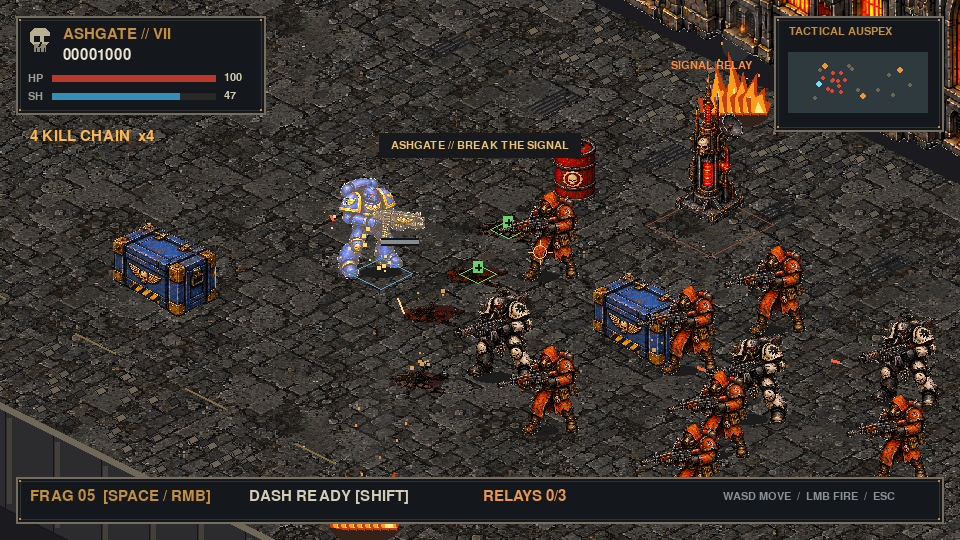
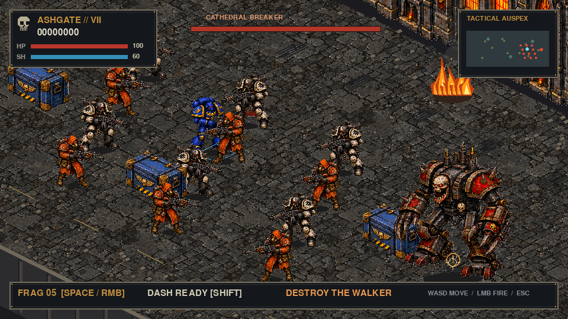

# Ashgate Siege

The default Hive City Rampage mode is now a playable isometric street assault inspired by the supplied reference. The original survival mode remains available with `--classic`.

```sh
.venv/bin/python src/pyg/hive_city_rampage.py
```

Destroy three red signal relays along the promenade. Each destroyed relay grants two grenades and restores some shield. Silencing the final relay summons the Cathedral-Breaker. Defeat it and enter the green extraction diamond at the far end of the street to win.

| Control | Action |
| --- | --- |
| WASD | Move relative to the screen |
| Mouse / left button | Aim / hold to fire the heavy gun |
| Space / right button | Throw an arcing frag grenade |
| Shift + movement | Dash; brief invulnerability, 2.2-second recharge |
| Escape | Pause / resume; quit after a completed or failed run |
| R | Restart after victory or death |
| M | Mute / unmute audio |
| - / = | Decrease / increase gunfire volume |

Crates stop movement and bullets until destroyed. Red barrels explode and can set off nearby barrels. Grenades and barrels can hurt you at close range. Rifle troops fire visible projectiles; runners close quickly; heavy infantry absorb more fire. The siege walker marks a strike area before attacking: move outside the red ring or time a dash. Green, blue, and gold pickups restore health, shield, and grenades respectively. Chain kills within 2.4 seconds to increase your score multiplier, up to 5x.

The window resizes with letterboxing and pixel scaling. The game runs at a native 960×540 resolution and opens at 1280×720. Add `--mute` to start with all audio muted or `--seed 42` to change combat randomness. Gunfire defaults to 80%; `--sfx-volume 0.6` sets its initial level. The pause panel shows this level. Music and all other effects have been removed following playtest feedback.

Bolter shots retain the four approved variations with metallic action, a pressure thump, and a mechanical tail. Audio pauses with gameplay. [Audio sources, licenses, and mixing notes](../src/pyg/assets/audio/CREDITS.md) document the retained CC0 samples.

## Implementation

- `isometric_game.py`: world-space simulation, collision, mission states, camera, depth-sorted rendering, HUD, and application loop.
- `isometric_art.py`: cached sprites and procedural art fallback.
- `siege_motion.py`: complete Blender-rendered pose playback for walking, recoil, weapon elevation, and boss windup. Exported muzzle coordinates also drive projectile origins.
- `siege_audio.py`: gunfire-only mixer with bounded voices, sample variation, pause, mute, and volume controls.
- `assets/rendered/`: character pose sheets; `assets/ashgate_atlas_clean.png`: cleaned character art; the cleaned atlas also supplies scenery props, with the original pavement underneath cached map lighting. Original source, exact prompts, and import details are recorded in [art provenance](../src/pyg/assets/ASHGATE_ART.md).
- `tests/test_isometric_game.py`: headless checks for projection, collision, explosives, mission progression, boss telegraphs, and death.

The mission has a fixed authored street layout and seeded enemy variations. Rendering projects world coordinates with `screen = (x-y, (x+y)/2)`. Combat and collision stay in unprojected coordinates. Movement converts screen directions back to the world, and mouse aim maps to the projectile's chest-height plane. Tall scenery and actors sort by ground contact depth.

## Verification

```sh
.venv/bin/python -m unittest discover -s tests -v
SDL_VIDEODRIVER=dummy SDL_AUDIODRIVER=dummy .venv/bin/python src/pyg/hive_city_rampage.py --smoke-test 600 --screenshot /tmp/ashgate.png
```

Characters use continuous textured 2D meshes with Blender armatures and blended skin weights. The player has five source views, including front and rear, producing eight compass directions with mirroring. Mouse aiming chooses a view with a small switching margin to prevent boundary flicker; walk phase continues through turns. Each view has its own exported muzzle socket. Enemy artwork retains its side views and small pre-rendered weapon elevation changes. Editable rigs, packed textures, and rebuild instructions are in [art/blender](../art/blender/README.md). Blender is only needed to rebuild the poses. Persistent upgrades and additional maps remain outside this mission.

Rebuild sound mixes with `.venv/bin/python tools/build_ashgate_audio.py`. Re-render the silent [motion review video](../static/ashgate-motion.mp4) with `.venv/bin/python tools/capture_ashgate_motion.py` (requires ffmpeg for this development tool only). The [effects preview](../static/ashgate-audio-preview.wav) is a short sequential demonstration, not synchronized gameplay audio.

## Preview

Opening combat captured from automated gameplay:



Boss encounter staged with the live renderer:



Directional aiming and walking: [mouse-orbit preview](../static/ashgate-directions.mp4) · [view sheet](../static/ashgate-directions.png).

## Effects, deaths, and scene lighting

Fire uses an eight-frame loop with per-instance phase offsets. Grenades, barrels, relays, and the walker use an eight-stage blast that cools into smoke over 1.05 seconds. A short local flash lights the paving and nearby characters. Gunfire remains the only enabled sound.

Enemies play authored hit, buckle, fall, and settled poses after a lethal hit. Collision and scoring resolve immediately. Corpses retain their facing, remain for 20 seconds, and fade over the final two seconds. Active falls and explosions participate in scene depth sorting. The renderer retains at most 64 death records and 32 blasts.

Scenery uses the cleaned atlas, contact shadows, cooler ground shading, and warm window/fire light baked into the cached floor at map load. This is 2D painted lighting with no physical occlusion simulation.

Rebuild the alpha effect sheets with `.venv/bin/python tools/prepare_ashgate_effects.py`. Generate the [effects/death preview](../static/ashgate-effects.mp4) and [scene lighting comparison](../static/ashgate-lighting.png) with `.venv/bin/python tools/capture_ashgate_effects.py`.

Reusable art direction, pipeline lessons, known limits, and the playtest record live in the [game art and motion playbook](design/ART_AND_MOTION_PLAYBOOK.md).

## Weapon alignment and final fades

The player now selects finer gun poses within each body view using exported barrel-axis and muzzle points. Selection accounts for muzzle parallax and walking/recoil. Bullets still travel exactly toward the mouse target; the finite pose grid leaves a small visual angular tolerance. Projectile lines and polygon muzzle flashes have been replaced by compact authored weapon sprites. The marine's foot travel, knee lift, and contact settling are stronger.

Corpse and explosion endings fade per-pixel alpha without darkening their RGB or mutating cached frames. Corpses no longer leave a persistent dark mark; residual explosion marks use softer edges. [Weapon, stride, and fade review](../static/ashgate-weapons.mp4).

## Wrist rig, casing ejection, and compact HUD

Weapons are rigidly weighted through the receiver and move with the hand at the wrist. The marine walk rotates rigid thigh, shin, and boot sections at the hip, knee, and ankle; armor panels no longer blend across leg bones. Each aiming pose exports its ejection port. Larger brass casings tumble through three drawn views, bounce, settle, and fade after six seconds before removal at eight.

The top-left health/shield HUD has no enclosing panel. Its servo-skull periodically displays short original Latin-styled High Gothic sayings. The top-right auspex is 132×88 with a translucent background and opaque markers. [Gameplay/HUD preview](../static/ashgate-servo-hud.mp4) · [HUD screenshot](../static/ashgate-servo-hud.png). Rebuild the capture with `.venv/bin/python tools/capture_ashgate_hud.py`.


### Authored player walking

Moving players combine `assets/rendered/upper` aiming torsos with `assets/rendered/walk` drawn lower bodies. The torso retains the existing per-frame muzzle, barrel, and ejection sockets. Four contact/passing keys replace procedural player leg motion during walking; front/rear opposite-foot phases use symmetry. Idle poses remain complete sprites. Movement direction is calculated from collision-resolved displacement, independently of aiming. The cycle advances per 132 world units, so blocked movement does not cycle the feet.

Rebuild lower sprites with `.venv/bin/python tools/prepare_ashgate_walk.py`; render upper layers using Blender's `rig_sprites.py -- --aiming --upper-body --render`, then `pack_sprites.py --upper-body`. Review `static/ashgate-walk.mp4` for all five source views and gameplay with fixed aim while travel changes.


### Torso/gait coordination correction

Travel is still measured independently of aim, but it no longer directly selects unrestricted leg facing. `gait_pose` keeps pelvis yaw within 45 degrees of the actual torso source view. Retreat uses the opposite travel direction for orientation and reverses the four-key cycle. Pure lateral movement uses the nearest allowed diagonal; these reuse the existing drawn poses, not dedicated strafe artwork. Both layers use the torso frame's normalized walk phase. Contact lowers the torso and passing raises it.

The lower belt is placed at the exported per-frame `waists` socket in the upper manifest. Combat geometry is read from those same upper clips, preserving alignment after timing changes. New renders/packing include pelvis metadata; `tools/blender/export_upper_waists.py` can also update sockets from an existing source without rendering. `static/ashgate-gait-sync.mp4` reviews all eight aim directions against all eight travel directions.


### Shared player state artwork and continuity audit

All player actions now use upper-layer torso sprites, including idle and stationary fire. Stopping selects the nearest lower-body contact key. `BELT_OVERLAP` seats the lower belt inside the visible hem; `GROUND_SHIFT` registers the corrected contact pose to the world ground. These are per-source-view calibrations and do not deform armor. The ground adjustment participates in muzzle/ejection geometry through `coordinates`.

Rebuild with `rig_sprites.py -- --aiming --upper-body --render` and `pack_sprites.py --upper-body`. Run `tools/audit_ashgate_sprites.py` and `tools/check_ashgate_seams.py` after art or registration changes. Review `static/sprite-audit/index.html` and the walk/stop/fire gameplay clip.
